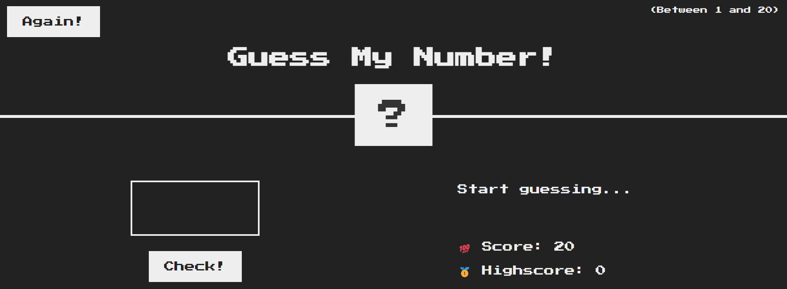
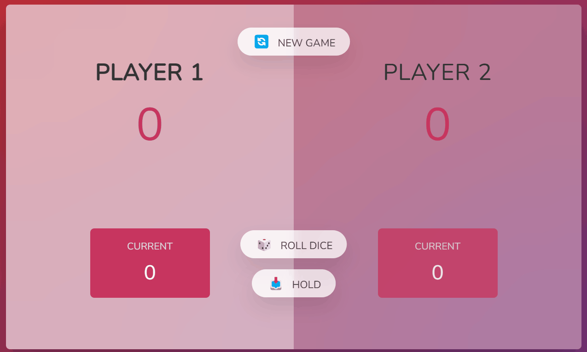
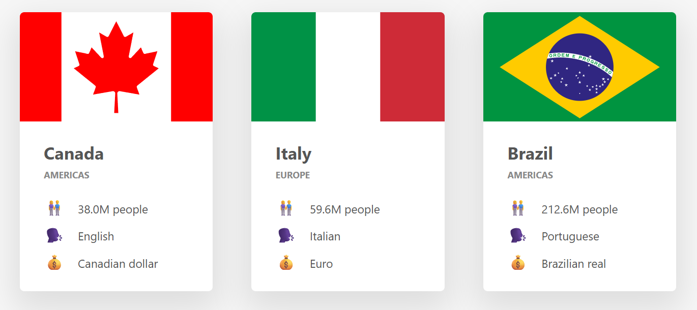

# Complete JavaScript Course Projects  
*Projects developed during "The Complete JavaScript Course: From Zero to Expert" (Udemy, Jonas Schmedtmann)*  

## 📝 Description  
Repository containing all practical projects built while following *The Complete JavaScript Course*.  
Focused on mastering modern JavaScript, problem-solving, and real-world development practices.  

---

## 🚀 Projects + Demos  

### **Guess My Number**  
  
A simple number guessing game. Practices conditional logic, DOM manipulation, and clean coding structure.  

---

### **Pig Game**  
  
Dice game for two players, managing scores and states. Involves event handling, loops, conditionals, and interactivity.  

---

### **Bankist App**  
  
A minimalistic online banking application featuring:  
- Array methods (map, filter, reduce)  
- DOM manipulation & element creation  
- Method chaining  
- Login, transfers, loan requests, and account closing  
- Date handling and internationalization (dates & currency)  
- Countdown timer with auto-logout functionality  

---

### **Bankist Landing Page**  
  
A modern interactive landing page with:  
- Advanced DOM manipulation  
- Smooth scrolling navigation  
- Tabbed components  
- Sticky navigation bar  
- Section reveal on scroll  
- Lazy loading images  
- Interactive slider/carousel  

---

### **Asynchronous JavaScript**  
  
  
Focused on async programming:  
- Promises  
- `async` / `await`  
- Error handling (try/catch)  
- AJAX requests & working with APIs  

---

## 🛠️ Tech Stack & Tools  
- **Modern JavaScript (ES6+)**: arrow functions, destructuring, spread/rest, optional chaining, template literals.  
- **OOP**: classes, prototypes, encapsulation, `this`, inheritance.  
- **Async JS**: event loop, Promises, async/await, fetch/AJAX.  
- **DOM & UX**: manipulation, dynamic elements, event handling, interactive UI/UX.  
- **Modern tools**: NPM, Parcel, Babel, ES Modules.  
- **Developer workflow**: code architecture, debugging, problem-solving.  

---
